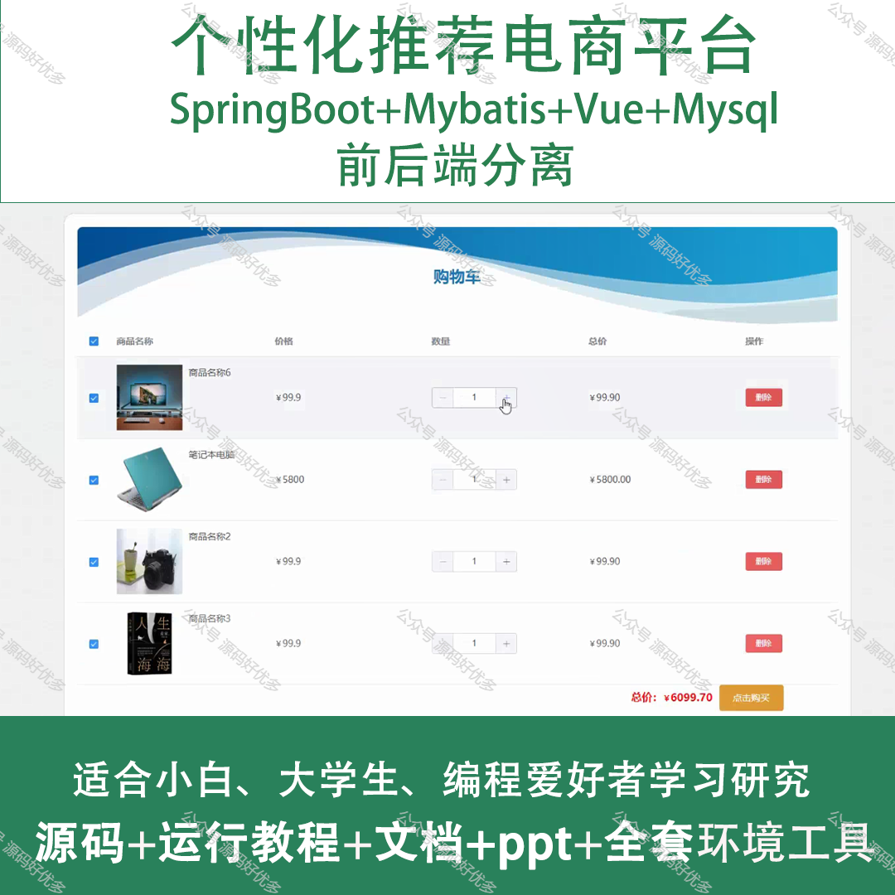
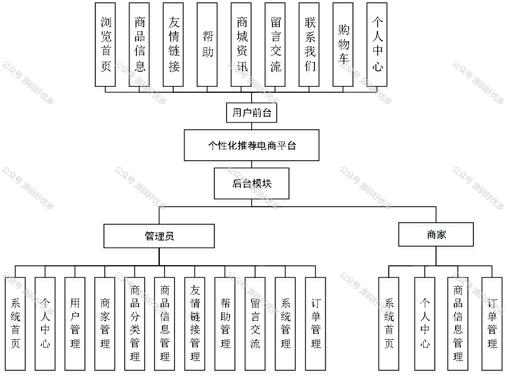
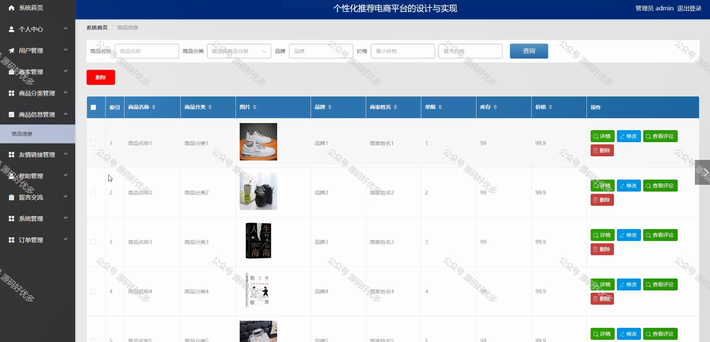
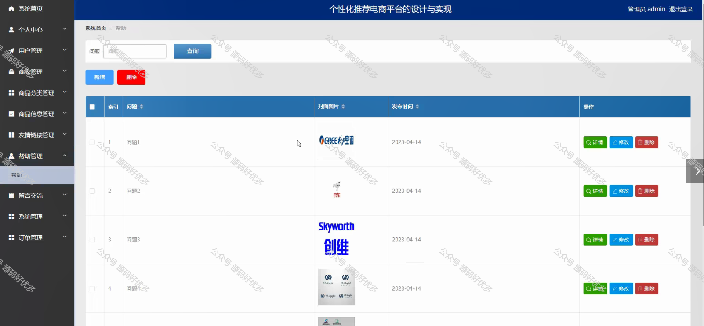
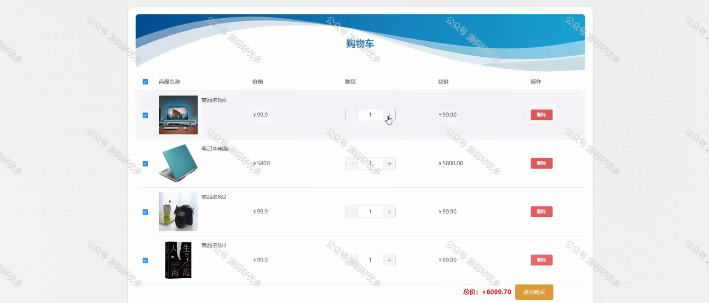
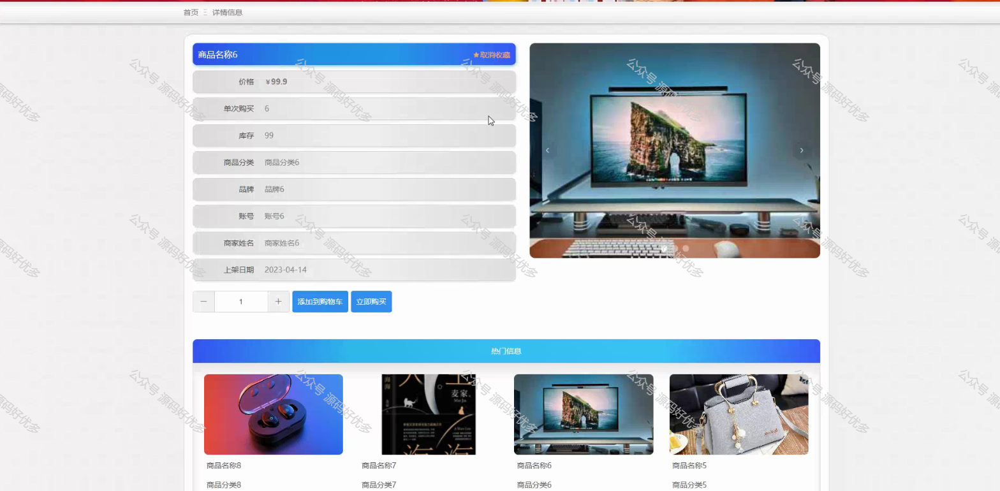
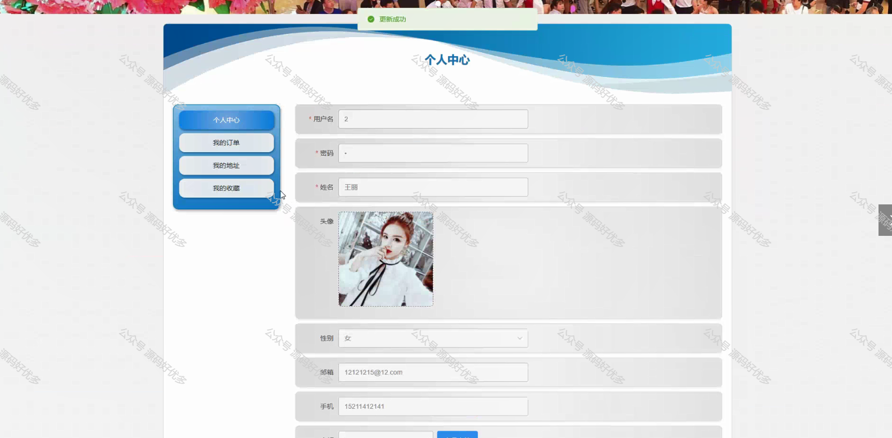
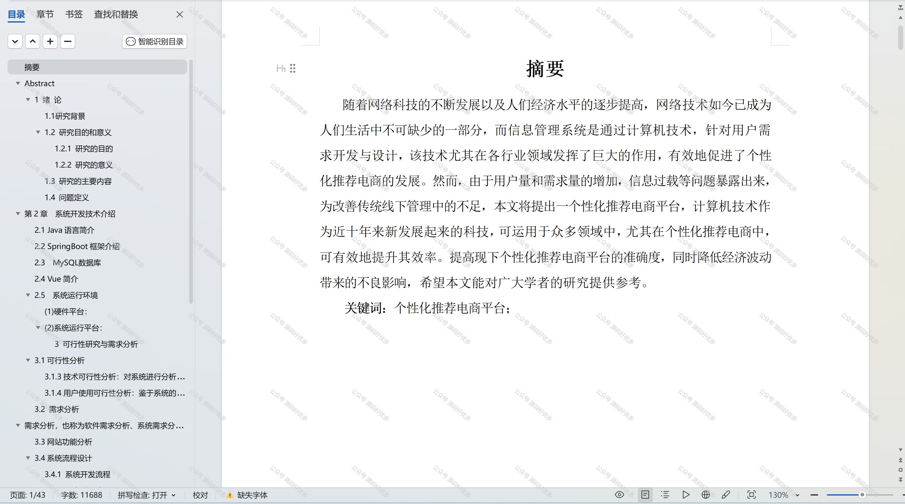

 
## 查看主页获取源码

### 一、作品包含

源码+数据库+设计文档万字+PPT+全套环境和工具资源+部署教程

### 二、项目技术

前端技术：Html、Css、Js、Vue、Element-ui

数据库：MySQL

后端技术：Java、Spring Boot、MyBatis

  

### 三、运行环境

开发工具：IDEA/eclipse

数据库：MySQL5.7

数据库管理工具：Navicat10以上版本

环境配置软件： JDK1.8+Maven3.6.3

前端Nodejs：14

### 四、项目介绍
项目编号：springbootA180

个性化推荐电商平台是为了满足消费者日益增长的个性化购物需求，提高购物体验，提升商品转化率而开发的。系统以电商平台为背景，紧密结合消费者的购物习惯和偏好，旨在为用户提供一个智能、精准、便捷的个性化购物平台。从而提高购物效率和满意度。同时，该系统还可以帮助商家更好地了解消费者需求，优化商品推荐策略，提高商品的销售业绩。此外，个性化推荐电商平台还具备良好的用户体验和可扩展性，为用户带来愉悦的购物体验。

前台用户功能：浏览首页、商品信息、友情链接、帮助、商城资讯、留言交流、联系我们、购物车、个人中心。

后台分为管理员和商家
管理员的功能：系统首页、个人中心、用户管理、商家管理、商品分类管理、商品信息管理、友情链接管理、帮助管理、留言交流、系统管理、订单管理。
商家的功能：系统首页、个人中心、商品信息管理、订单管理。

### 五、运行截图

  
